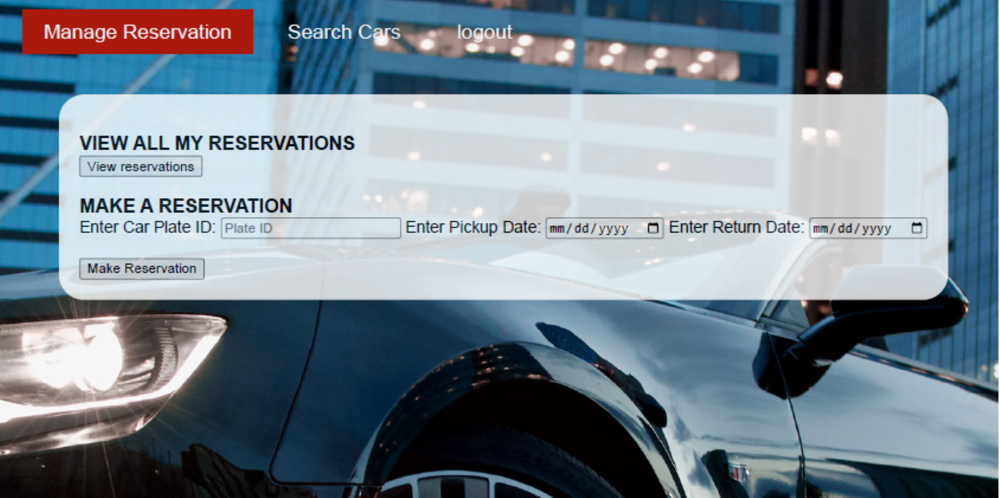

# Dash Car Rental
 Car rental website.
## Rundown: 
 [See report](./Car-Rental-System.pdf).
## Screnshots:
 
 
 
   
    
## Features:
 - The admin can register a new car (model, year, plate id, etc.) and update car status (active, out of service, rented, etc.)
 - Registers multiple offices, allowing customers to reserve their cars from anywhere in the world via this system.
 - Customers can provide information by filling in their personal information to create an account and then he or she can reserve a car.
 - Customers are aided by your system to search the available cars by any of the car specs according to their needs.
 - Admin can perform an advanced search which is searching by any of the car information, customer information or reservation day to get all information about the car, customer and reservation.
 - The website provides the admin with basic necessary reports:
   - All reservations within a specified period including all car and customer information.
   - All reservations of any car within a specified period including all car information.
   - The status of all cars on a specific day.
   - All reservations of a specific customer including customer information, car model and plate id.
   - All payments within a specific period.
## Launching the site:
### Prerequisites:
 - Xampp
### Steps:
 - copy the Dash Car Rental directory into the htdocs folder in the xampp directory
 - create the database the SQL files in PHPmyadmin
 - from the xampp control panel,start Apache and MySQL
 - in your browser go to localhost/Dash Car Rental
## Future Improvements:
 - TBD
## Contributors:
 - [Mohammad Helaly](https://github.com/MohammadHelaly)
 - [Abdelrahman El-Attarr](https://github.com/abdelrahmanelattarr)
 - [Omar Shehab](https://github.com/omarshehab7)
 - [Mohamed Shamarka](https://github.com/Shamarka)
